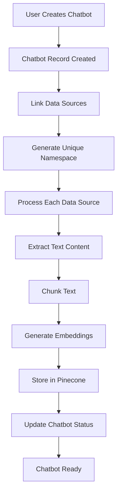

# Chatbot Creation Process with Data Sources - Internal Architecture

## Table of Contents
- [Overview](#overview)
- [High-Level Process Flow](#high-level-process-flow)
- [Detailed Internal Process](#detailed-internal-process)
- [Vector Combination Strategy](#vector-combination-strategy)
- [Namespace Management](#namespace-management)
- [Processing Pipeline](#processing-pipeline)
- [Query-Time Vector Search](#query-time-vector-search)
- [Code Implementation Details](#code-implementation-details)

## Overview

When a chatbot is created with multiple data sources, the platform orchestrates a complex process of data extraction, vectorization, and intelligent organization to enable context-aware AI responses. This document explains the internal mechanics of how this works.

## High-Level Process Flow



## Detailed Internal Process

### 1. Chatbot Creation Initiation

When a user creates a chatbot with data sources, the following happens:

```typescript
// Step 1: Create chatbot record in database
const chatbot = {
  id: generateUUID(),
  name: "Customer Support Bot",
  company_id: currentCompany.id,
  pinecone_namespace: `${companyId}_${chatbotId}`, // Unique namespace
  status: 'processing', // Since it has data sources
  created_at: new Date()
}

// Step 2: Create associations in chatbot_data_sources table
for (const dataSourceId of dataSourceIds) {
  await createChatbotDataSourceLink(chatbot.id, dataSourceId)
}
```

### 2. Namespace Generation

Each chatbot gets a unique namespace in Pinecone to isolate its vectors:

```typescript
// Namespace pattern: {companyId}_{chatbotId}
const namespace = `${company.id}_${chatbot.id}`;

// Example: "550e8400-e29b-41d4-a716-446655440000_9b1deb4d-3b7d-4bad-9bdd-2b0d7b3dcb6d"
```

**Why namespaces?**
- **Isolation**: Each chatbot's knowledge is completely isolated
- **Multi-tenancy**: Different companies' data never mix
- **Performance**: Queries only search relevant vectors
- **Management**: Easy to delete/update specific chatbot data

### 3. Data Source Processing

Each data source linked to the chatbot goes through processing:

```typescript
// For each data source linked to the chatbot
async function processDataSourceForChatbot(dataSource, chatbot) {
  // 1. Check if already processed
  if (dataSource.pinecone_namespace) {
    // Copy vectors to new chatbot namespace
    await copyVectorsToNamespace(
      dataSource.pinecone_namespace,
      chatbot.pinecone_namespace
    );
    return;
  }

  // 2. New data source - process from scratch
  const fileContent = await downloadFromStorage(dataSource.storage_path);
  const extractedText = await extractText(fileContent, dataSource.type);
  const chunks = await intelligentChunking(extractedText);
  
  // 3. Generate embeddings for each chunk
  for (const chunk of chunks) {
    const embedding = await generateEmbedding(chunk.text);
    await storeInPinecone(embedding, chunk, chatbot.pinecone_namespace);
  }
}
```

## Vector Combination Strategy

### How Multiple Data Sources Are Combined

When a chatbot has multiple data sources, their vectors are **logically combined** in the same namespace:

```
Pinecone Namespace: company123_chatbot456
├── Vectors from DataSource1 (PDF - Product Manual)
│   ├── Vector1: "Product features include..."
│   ├── Vector2: "Installation steps are..."
│   └── Vector3: "Troubleshooting guide..."
├── Vectors from DataSource2 (CSV - FAQ)
│   ├── Vector4: "Q: How to reset password? A:..."
│   ├── Vector5: "Q: What are business hours? A:..."
│   └── Vector6: "Q: Refund policy? A:..."
└── Vectors from DataSource3 (URL - Company About Page)
    ├── Vector7: "Founded in 2020..."
    ├── Vector8: "Our mission is..."
    └── Vector9: "Contact us at..."
```

### Vector Storage Structure

Each vector in Pinecone contains:

```typescript
{
  id: "datasource1_chunk_0",
  values: [0.1, -0.2, 0.3, ...], // 384-dimensional embedding
  metadata: {
    text: "Original text chunk content",
    source_id: "datasource_uuid",
    source_name: "product_manual.pdf",
    chunk_index: 0,
    total_chunks: 150,
    document_id: "doc_uuid",
    created_at: "2024-01-05T12:00:00Z"
  }
}
```

## Namespace Management

### Single Namespace per Chatbot

Each chatbot uses **ONE namespace** that contains vectors from ALL its data sources:

```typescript
// When searching for context
const searchResults = await pinecone.query({
  namespace: chatbot.pinecone_namespace, // Single namespace
  vector: queryEmbedding,
  topK: 40,
  includeMetadata: true
});

// Results may come from any data source
// The AI model considers all sources equally
```

### Benefits of Single Namespace Approach

1. **Holistic Understanding**: AI can correlate information across different sources
2. **Simplified Queries**: One search covers all knowledge
3. **Better Context**: Related information from different sources can be retrieved together
4. **Efficient Storage**: No duplication of common information

## Processing Pipeline

### Asynchronous Processing with Inngest

The platform uses Inngest for background processing:

```typescript
// When data sources are added to chatbot
await inngest.send({
  name: "chatbot/process-datasources",
  data: {
    chatbotId: chatbot.id,
    dataSourceIds: selectedDataSourceIds,
    namespace: chatbot.pinecone_namespace
  }
});

// Inngest function processes each data source
export const processChatbotDataSources = inngest.createFunction(
  { id: "process-chatbot-datasources" },
  { event: "chatbot/process-datasources" },
  async ({ event, step }) => {
    const { chatbotId, dataSourceIds, namespace } = event.data;
    
    // Process each data source
    for (const dataSourceId of dataSourceIds) {
      await step.run(`process-${dataSourceId}`, async () => {
        await processDataSourceForNamespace(dataSourceId, namespace);
      });
    }
    
    // Update chatbot status
    await step.run("update-status", async () => {
      await updateChatbotStatus(chatbotId, 'ready');
    });
  }
);
```

### Text Chunking Strategy

Different strategies for different file types:

```typescript
function chunkText(text: string, fileType: string): Chunk[] {
  const chunks: Chunk[] = [];
  
  switch(fileType) {
    case 'qa_pairs':
      // Each Q&A pair becomes one chunk
      return text.split('\n').map((qa, index) => ({
        id: `chunk_${index}`,
        text: qa,
        metadata: { type: 'qa_pair' }
      }));
      
    case 'pdf':
    case 'docx':
      // Smart paragraph-based chunking
      return smartParagraphChunking(text, {
        maxChunkSize: 1000,
        overlapSize: 100
      });
      
    case 'csv':
      // Row-based chunking with header context
      return csvChunking(text, {
        includeHeaders: true,
        maxRowsPerChunk: 10
      });
      
    default:
      // Default sliding window
      return slidingWindowChunking(text, {
        windowSize: 1000,
        stepSize: 900
      });
  }
}
```

## Query-Time Vector Search

### How Queries Work Across Multiple Data Sources

When a user asks a question:

```typescript
async function handleChatQuery(message: string, chatbotId: string) {
  // 1. Generate embedding for user's question
  const queryEmbedding = await generateEmbedding(message);
  
  // 2. Search in chatbot's namespace (contains all data sources)
  const searchResults = await pinecone.query({
    namespace: chatbot.pinecone_namespace,
    vector: queryEmbedding,
    topK: 40, // Get top 40 most relevant chunks
    includeMetadata: true,
    filter: {} // No filter needed - namespace already isolates
  });
  
  // 3. Results might come from different sources
  // Example results:
  // - Chunk from PDF manual (similarity: 0.92)
  // - Chunk from FAQ (similarity: 0.89)
  // - Chunk from website (similarity: 0.87)
  
  // 4. Build context from all sources
  const context = searchResults.matches
    .map(match => match.metadata.text)
    .join('\n\n');
  
  // 5. Generate response using combined context
  const response = await generateAIResponse(message, context);
  
  return response;
}
```

### Relevance Scoring Across Sources

The system doesn't discriminate between data sources - relevance is purely based on semantic similarity:

```typescript
// All chunks compete equally based on relevance
const rankedResults = searchResults.matches.sort((a, b) => b.score - a.score);

// A FAQ chunk might rank higher than a manual chunk
// if it's more relevant to the user's question
```

## Code Implementation Details

### Key Service Methods

```typescript
// ChatbotService - Creating chatbot with data sources
async createChatbot(data: CreateChatbotData) {
  // 1. Create chatbot record
  const chatbot = await this.supabase
    .from('chatbots')
    .insert({
      ...data,
      pinecone_namespace: `${data.company_id}_${uuid()}`,
      status: data.data_source_ids?.length > 0 ? 'processing' : 'ready'
    })
    .select()
    .single();

  // 2. Link data sources
  if (data.data_source_ids?.length > 0) {
    await this.associateDataSources(chatbot.id, data.data_source_ids);
    
    // 3. Trigger processing
    await this.triggerDataProcessing(chatbot);
  }
  
  return chatbot;
}

// DataProcessingService - Process and combine vectors
async processDataSourcesForChatbot(chatbotId: string, dataSourceIds: string[]) {
  const chatbot = await this.getChatbot(chatbotId);
  const namespace = chatbot.pinecone_namespace;
  
  // Process each data source into the same namespace
  const processingTasks = dataSourceIds.map(dsId => 
    this.processDataSource(dsId, namespace)
  );
  
  await Promise.all(processingTasks);
  
  // Update chatbot status
  await this.updateChatbotStatus(chatbotId, 'ready');
}
```

### Vector Metadata Structure

```typescript
interface VectorMetadata {
  // Source identification
  source_id: string;
  source_name: string;
  source_type: 'pdf' | 'csv' | 'url' | 'text' | 'qa_pairs';
  
  // Chunk information
  chunk_index: number;
  total_chunks: number;
  text: string;
  
  // Context information
  preceding_text?: string;  // For context continuity
  following_text?: string;
  
  // Timestamps
  processed_at: string;
  
  // Optional metadata
  page_number?: number;     // For PDFs
  row_numbers?: number[];   // for CSVs
  url?: string;            // For web sources
}
```

### Performance Optimizations

```typescript
// 1. Batch processing of embeddings
async function batchProcessEmbeddings(chunks: Chunk[], namespace: string) {
  const BATCH_SIZE = 50;
  
  for (let i = 0; i < chunks.length; i += BATCH_SIZE) {
    const batch = chunks.slice(i, i + BATCH_SIZE);
    
    // Generate embeddings in parallel
    const embeddings = await Promise.all(
      batch.map(chunk => generateEmbedding(chunk.text))
    );
    
    // Prepare vectors for batch upsert
    const vectors = embeddings.map((embedding, index) => ({
      id: `${namespace}_chunk_${i + index}`,
      values: embedding,
      metadata: batch[index].metadata
    }));
    
    // Batch upsert to Pinecone
    await pinecone.upsert({ vectors, namespace });
  }
}

// 2. Caching frequently accessed vectors
const vectorCache = new Map<string, CachedVector>();

async function getCachedOrFetch(namespace: string, query: number[]) {
  const cacheKey = `${namespace}_${hashVector(query)}`;
  
  if (vectorCache.has(cacheKey)) {
    return vectorCache.get(cacheKey);
  }
  
  const results = await pinecone.query({ namespace, vector: query });
  vectorCache.set(cacheKey, results);
  
  return results;
}
```

## Summary

The chatbot creation process with multiple data sources involves:

1. **Unified Namespace**: All data sources for a chatbot share one namespace
2. **Parallel Processing**: Multiple data sources are processed concurrently
3. **Smart Chunking**: File-type-specific chunking strategies
4. **Semantic Search**: Queries search across all sources simultaneously
5. **Context Building**: AI receives context from multiple sources for comprehensive answers

This architecture ensures that chatbots can leverage information from diverse sources while maintaining isolation between different chatbots and companies.
