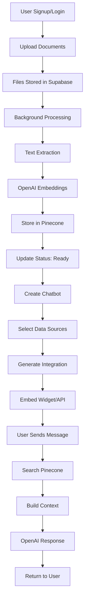

# 🏗️ AI Chatbot Platform - Backend Flow & Architecture

## 📋 Overview

This document outlines the complete backend flow for the multi-tenant AI chatbot platform, focusing on the data pipeline from authentication to chat interaction. **All table fields and types are now precisely aligned with the database schema.**

## 🎯 Core Flow Summary

```
User Authentication → File Upload → Vector Processing → Chatbot Creation → Integration → Chat Interface
```

---

## 🔐 1. Authentication Flow

### Implementation: Supabase Client SDK + Server SDK

**Frontend (Client SDK):**
- User signup/login via Supabase Auth
- Session management in browser
- Automatic token refresh

**Backend (Server SDK):**
- API routes use service role key
- User verification and data access control
- Multi-tenant data isolation

### Flow Diagram:
```
┌─────────────┐    ┌──────────────┐    ┌─────────────────┐
│   Browser   │───▶│ Supabase Auth│───▶│ Next.js API     │
│  (Client)   │    │  (Client SDK) │    │ (Server SDK)    │
└─────────────┘    └──────────────┘    └─────────────────┘
       │                    │                     │
       ▼                    ▼                     ▼
┌─────────────┐    ┌──────────────┐    ┌─────────────────┐
│ JWT Token   │    │ User Session │    │ Protected Routes│
│ Management  │    │ Persistence  │    │ + Data Access   │
└─────────────┘    └──────────────┘    └─────────────────┘
```

---

## 🏢 2. Company Creation & User Management Flow

### Implementation: Multi-Tenant Company Structure

#### Company Signup Flow:

**Frontend Signup Process:**
- User provides: email, password, name
- **Checkbox:** "I want to create a new company"
  - If checked: show company name field (required)
  - If not checked: company info not required (user is employee or visitor)
- User is assigned a role:
  - If creating a new company: role is `'owner'` (`user_role` enum), company is created
  - If not: role is `'employee'` or `'visitor'` (see below)

#### Backend Implementation:

**Create New Company**
```typescript
// /api/companies/create-with-owner
POST /api/companies/create-with-owner
{
  "companyName": "Acme Corp",
  "userEmail": "john@acme.com",
  "userName": "John Smith",
  "password": "encrypted_password"
}

Flow:
1. Create company record
2. Create user in Supabase Auth
3. Link user to company with role 'owner' (user_role enum)
4. Return success + redirect to dashboard
```

**Join as Employee or Visitor**
- If user is already registered and company exists, admin can add them to the company as `'employee'` (`user_role` enum).
- If admin tries to add a user who is not registered, an error is shown: "User not registered on the platform."
- No invitation or token flow is used.
- Users who do not belong to any company are assigned the `'visitor'` role and only have access to public chatbots.

### Employee Management System:

#### Company Owner/Admin Capabilities:
- **Team Management Page**: `/dashboard/team`
- **Add Employees**: Add existing users by email
- **Manage Roles**: owner, admin, employee (all from `user_role` enum)
- **View Team**: List all company members

#### Required API Routes:

```typescript
// Company Management
POST /api/companies/create-with-owner - Create company + owner
GET /api/companies/[id]/members - List company members
PUT /api/companies/[id]/members/[userId] - Update member role
DELETE /api/companies/[id]/members/[userId] - Remove member

// User Role Management
GET /api/users/me - Get current user + role
PUT /api/users/[id]/role - Update user role (owner/admin only)
```

### Role-Based Access Control (RBAC):

#### User Roles (`user_role` enum):
- **Owner**: Created the company, full access
- **Admin**: Appointed by owner, can manage team and settings
- **Employee**: Standard user, can use chatbots and view analytics
- **Visitor**: Not part of any company, can only access public chatbots

#### Permission Matrix:
| Action | Owner | Admin | Employee | Visitor |
|--------|-------|-------|----------|---------|
| Create/Delete Chatbots | ✅ | ✅ | ❌ | ❌ |
| Manage Team (Add/Remove) | ✅ | ✅ | ❌ | ❌ |
| View Analytics | ✅ | ✅ | ✅ | ❌ |
| Upload Data Sources | ✅ | ✅ | ✅ | ❌ |
| Use Internal Chatbots | ✅ | ✅ | ✅ | ❌ |
| Company Settings | ✅ | ❌ | ❌ | ❌ |
| Billing/Subscription | ✅ | ❌ | ❌ | ❌ |
| Use Public Chatbots | ✅ | ✅ | ✅ | ✅ |

---

## 🗄️ 3. Database Schema Design (Aligned with Schema Doc)

### Enums (All enums are defined in the database for type safety):
- `user_role`: 'owner', 'admin', 'employee', 'visitor'
- `data_source_type`: 'pdf', 'csv', 'xlsx', 'txt', 'docx', 'json'
- `data_source_status`: 'processing', 'ready', 'error'
- `chatbot_type`: 'public', 'internal'
- `chatbot_personality`: 'professional', 'friendly', 'casual', 'formal', 'technical'
- `integration_type`: 'widget', 'iframe', 'api'
- `message_type`: 'user', 'assistant'

### Table Definitions

#### `users` (Handled by Supabase Auth)
```sql
users (
  id: uuid PRIMARY KEY,
  email: text UNIQUE,
  name: text,
  role: user_role NOT NULL DEFAULT 'visitor',
  company_id: uuid REFERENCES companies(id) ON DELETE CASCADE, -- Nullable for visitors
  created_at: timestamp,
)
```
- **Indexes:** company_id, email, role
- **Cascade delete:** Deleting a company deletes its users

#### `companies`
```sql
companies (
  id: uuid PRIMARY KEY,
  name: text NOT NULL,
  created_at: timestamp DEFAULT now()
)
```

#### `data_sources`
```sql
data_sources (
  id: uuid PRIMARY KEY,
  name: text NOT NULL,
  type: data_source_type NOT NULL,
  size: bigint,
  status: data_source_status DEFAULT 'processing',
  storage_path: text,
  pinecone_namespace: text,
  company_id: uuid NOT NULL REFERENCES companies(id) ON DELETE CASCADE,
  created_at: timestamp DEFAULT now()
)
```
- **Indexes:** company_id, status, type

#### `chatbots`
```sql
chatbots (
  id: uuid PRIMARY KEY,
  name: text NOT NULL,
  description: text,
  type: chatbot_type NOT NULL DEFAULT 'public',
  welcome_message: text,
  personality: chatbot_personality DEFAULT 'professional',
  theme: jsonb,
  is_active: boolean DEFAULT true,
  company_id: uuid NOT NULL REFERENCES companies(id) ON DELETE CASCADE,
  created_at: timestamp DEFAULT now(),
  updated_at: timestamp DEFAULT now()
)
```
- **Indexes:** company_id, type, is_active
- **Trigger:** `updated_at` is automatically updated on row update

#### `chatbot_data_sources`
```sql
chatbot_data_sources (
  id: uuid PRIMARY KEY,
  chatbot_id: uuid NOT NULL REFERENCES chatbots(id) ON DELETE CASCADE,
  data_source_id: uuid NOT NULL REFERENCES data_sources(id) ON DELETE CASCADE,
  created_at: timestamp DEFAULT now(),
  UNIQUE(chatbot_id, data_source_id)
)
```
- **Indexes:** chatbot_id, data_source_id

#### `integrations`
```sql
integrations (
  id: uuid PRIMARY KEY,
  chatbot_id: uuid NOT NULL REFERENCES chatbots(id) ON DELETE CASCADE,
  type: integration_type NOT NULL,
  api_key: text UNIQUE,
  settings: jsonb,
  company_id: uuid NOT NULL REFERENCES companies(id) ON DELETE CASCADE,
  created_at: timestamp DEFAULT now()
)
```
- **Indexes:** company_id, chatbot_id, api_key

#### `chat_sessions`
```sql
chat_sessions (
  id: uuid PRIMARY KEY,
  chatbot_id: uuid NOT NULL REFERENCES chatbots(id) ON DELETE CASCADE,
  session_id: text UNIQUE NOT NULL,
  user_ip: text,
  user_agent: text,
  created_at: timestamp DEFAULT now(),
  ended_at: timestamp
)
```
- **Indexes:** chatbot_id, session_id, created_at

#### `chat_messages`
```sql
chat_messages (
  id: uuid PRIMARY KEY,
  session_id: uuid NOT NULL REFERENCES chat_sessions(id) ON DELETE CASCADE,
  message: text NOT NULL,
  response: text,
  message_type: message_type NOT NULL,
  tokens_used: integer,
  response_time_ms: integer,
  created_at: timestamp DEFAULT now()
)
```
- **Indexes:** session_id, message_type, created_at

### Triggers & Functions
- **`updated_at` trigger:** Automatically updates `updated_at` on `chatbots` table row update.
- **User profile creation trigger:** On new Supabase Auth user, a profile is created in `users` table with default role 'visitor'.

### Cascade Deletes & Constraints
- **Cascade deletes:** Deleting a company deletes all related users, data sources, chatbots, integrations, etc.
- **Unique constraints:** e.g., `chatbot_data_sources` has unique (chatbot_id, data_source_id), `integrations` has unique api_key.
- **Indexes:** All foreign keys and frequently queried columns are indexed for performance.

---

## 📁 4. File Upload & Processing Flow

### Current Implementation Analysis:
- ✅ Frontend upload UI exists (`EnhancedUploadZone`)
- ✅ File type detection implemented
- ✅ File status tracking (`processing`, `ready`, `error` from `data_source_status` enum)
- ❌ **Missing:** Backend API integration
- ❌ **Missing:** Supabase Storage integration
- ❌ **Missing:** Vector embedding pipeline

### Required Backend Implementation:

#### Step 1: File Upload API Route
```typescript
// /api/upload/route.ts
POST /api/upload
- Validates user authentication
- Uploads file to Supabase Storage
- Creates DataSource record in Supabase DB (type: data_source_type, status: data_source_status)
- Triggers vector processing pipeline
```

#### Step 2: Vector Processing Pipeline
```typescript
// /api/process-file/route.ts
POST /api/process-file
- Extracts text from uploaded file (PDF, CSV, etc.)
- Chunks text into appropriate segments
- Generates embeddings using OpenAI API
- Stores vectors in Pinecone with metadata
- Updates DataSource status to "ready"
```

---

## 🤖 5. Chatbot Creation & Management

### Current Status:
- ✅ Frontend chatbot creation UI exists
- ✅ Data source selection implemented
- ❌ **Missing:** Backend API for chatbot CRUD operations

### Required Implementation:

```typescript
// /api/chatbots/route.ts
GET /api/chatbots - List user's chatbots
POST /api/chatbots - Create new chatbot

// /api/chatbots/[id]/route.ts
GET /api/chatbots/[id] - Get chatbot details
PUT /api/chatbots/[id] - Update chatbot
DELETE /api/chatbots/[id] - Delete chatbot
```

### Flow Diagram:

```
┌─────────────────┐    ┌─────────────────┐    ┌─────────────────┐
│ Frontend Form   │───▶│ /api/chatbots   │───▶│ Supabase DB     │
│ - Name          │    │ (POST)          │    │ - chatbots      │
│ - Description   │    │ - Validation    │    │ - relations     │
│ - Data Sources  │    │ - Auth Check    │    │                 │
└─────────────────┘    └─────────────────┘    └─────────────────┘
                                │
                                ▼
                       ┌─────────────────┐
                       │ Generate        │
                       │ - API Key       │
                       │ - Integration   │
                       │ - Widget Code   │
                       └─────────────────┘
```

---

## 💬 6. Chat Sessions & Messages (NEW)

### Chat Sessions
- Each chat interaction is grouped into a session (`chat_sessions` table).
- Sessions are linked to chatbots and store metadata (IP, user agent, timestamps).
- Used for analytics, context, and conversation history.

### Chat Messages
- Each message (user or assistant) is stored in `chat_messages` table.
- Linked to a session, includes message type (`message_type` enum), tokens used, response time, etc.
- Enables full chat history, analytics, and cost tracking.

---

## 🔐 7. Chatbot Types & Access Control

### Chatbot Types (`chatbot_type` enum):

#### Public Chatbots
- **Purpose**: Website embedding, customer-facing
- **Access**: Open to anyone
- **Route**: `/chat/public?bot={id}`
- **Authentication**: None required
- **Use Cases**: Customer support, product information, general inquiries

#### Internal Chatbots  
- **Purpose**: Internal staff use, secure operations
- **Access**: Authenticated staff only
- **Route**: `/chat/internal?bot={id}`
- **Authentication**: Role-based access control
- **Use Cases**: HR assistance, internal documentation, secure data queries

### Access Control Flow:

```
┌─────────────────┐    ┌─────────────────┐    ┌─────────────────┐
│ User Accesses   │───▶│ Check Bot Type  │───▶│ Route Decision  │
│ Chatbot URL     │    │ (public/internal│    │ Based on Type   │
└─────────────────┘    └─────────────────┘    └─────────────────┘
                                │                       │
                                ▼                       ▼
                       ┌─────────────────┐    ┌─────────────────┐
                       │ Public Bot      │    │ Internal Bot    │
                       │ - No auth       │    │ - Auth required │
                       │ - Open access   │    │ - Role checking │
                       │ - /chat/public  │    │ - /chat/internal│
                       └─────────────────┘    └─────────────────┘
```

### Required Backend Implementation:

#### Authentication Middleware
```typescript
// /api/auth/verify-internal-access.ts
POST /api/auth/verify-internal-access
- Validates user session/JWT
- Checks user role permissions (user_role enum)
- Returns access level (admin/staff/viewer)
```

#### Chatbot Access API
```typescript
// /api/chatbots/[id]/access.ts
GET /api/chatbots/[id]/access
- Verifies chatbot exists
- Checks chatbot type (chatbot_type enum)
- Validates user permissions for internal bots
- Returns access status and chatbot config
```

---

## 🔗 8. Integration & Embedding

### Current Status:
- ✅ Frontend integration UI exists
- ✅ Code generation for Widget/iFrame/API
- ❌ **Missing:** Backend endpoints for integrations

### Required Implementation:

```typescript
// /api/integrations/route.ts
GET /api/integrations/[chatbot_id] - Get integration details
POST /api/integrations - Create/update integration

// /api/widget/[chatbot_id]/route.ts
GET /api/widget/[chatbot_id] - Serve widget JavaScript

// /api/embed/[chatbot_id]/route.ts
GET /api/embed/[chatbot_id] - Serve iframe HTML
```

---

## 💬 9. Chat Interface & AI Response

### Implementation Flow:

```
┌─────────────┐    ┌─────────────────┐    ┌─────────────────┐
│ User Message│───▶│ /api/chat       │───▶│ Bot Type Check  │
│ (Public/    │    │ (POST)          │    │ Public/Internal │
│ Internal)   │    │ - Bot type check│    │                 │
└─────────────┘    │ - Auth check*   │    └─────────────────┘
                   │ - Rate limiting │             │
                   └─────────────────┘             ▼
                            │                ┌─────────────────┐
                            ▼                │ Pinecone Search │
                   ┌─────────────────┐       │ - Query vectors │
                   │ Access Control  │───────▶│ - Find relevant │
                   │ - Public: Open  │       │   content       │
                   │ - Internal: Auth│       └─────────────────┘
                            │                       │
                            ▼                       ▼
                   ┌─────────────────┐    ┌─────────────────┐
                   │ OpenAI API      │◀───│ Context Builder │
                   │ - GPT Response  │    │ - Relevant docs │
                   │ - System prompt │    │ - Chat history  │
                   └─────────────────┘    └─────────────────┘
                            │
                            ▼
                   ┌─────────────────┐
                   │ Response to User│
                   │ - Formatted     │
                   │ - Streamed      │
                   └─────────────────┘
```

### Required API Route:

```typescript
// /api/chat/route.ts
POST /api/chat
{
  "chatbot_id": "uuid",
  "message": "User question",
  "session_id": "session_uuid", // For conversation context
  "context": "additional_context" // Optional
}

Response:
{
  "response": "AI generated answer",
  "sources": ["doc1.pdf page 2", "doc2.csv row 15"],
  "session_id": "session_uuid"
}
```

---

## 📊 10. Complete API Structure

### Required API Routes:

```
🔐 Authentication & Company Management
├── POST /api/companies/create-with-owner - Create company + owner user
├── POST /api/invitations/accept - Accept employee invitation
└── Handled by Supabase Auth (Client SDK) for basic auth

🏢 Company Management
├── GET /api/companies/[id]/members - List company team members
├── PUT /api/companies/[id]/members/[userId] - Update member role
├── DELETE /api/companies/[id]/members/[userId] - Remove team member
└── GET /api/users/me - Get current user info + role

👥 Invitation System
├── POST /api/invitations - Send employee invitation email
├── GET /api/invitations/[token] - Validate invitation token
├── DELETE /api/invitations/[id] - Cancel pending invitation
└── GET /api/companies/[id]/invitations - List pending invitations

📁 File Management
├── POST /api/upload - Upload files to storage
├── POST /api/process-file - Process & vectorize files
└── GET /api/files/[id] - Get file details

🤖 Chatbot Management
├── GET /api/chatbots - List chatbots
├── POST /api/chatbots - Create chatbot
├── GET /api/chatbots/[id] - Get chatbot
├── PUT /api/chatbots/[id] - Update chatbot
└── DELETE /api/chatbots/[id] - Delete chatbot

🔗 Integrations
├── GET /api/integrations/[chatbot_id] - Get integration
├── POST /api/integrations - Create integration
├── GET /api/widget/[chatbot_id] - Widget JS
└── GET /api/embed/[chatbot_id] - Embed HTML

💬 Chat Interface
├── POST /api/chat - Process chat messages (public & internal)
├── GET /api/conversations/[session_id] - Get chat history
├── POST /api/chat/stream - Streaming responses
└── GET /api/chat/[type]/[bot_id] - Serve chat interface (public/internal)

🔐 Authentication & Access
├── POST /api/auth/verify-internal-access - Verify internal chatbot access
├── GET /api/chatbots/[id]/access - Check chatbot access permissions
└── POST /api/auth/staff-login - Staff authentication for internal bots

📈 Analytics
├── GET /api/analytics/dashboard - Dashboard stats
└── GET /api/analytics/chatbot/[id] - Chatbot metrics
```

---

## 🔄 11. Data Flow Summary

### Complete User Journey:



---

## 🛡️ 12. Security Considerations

### Data Isolation
- All queries filtered by `company_id`
- Row Level Security (RLS) in Supabase
- Pinecone namespacing by company
- **Role-Based Access Control (RBAC)**:
  - Owner: Full company access + team management
  - Admin: Team management + chatbot operations
  - Employee: Basic usage + internal chatbot access
- Separate access controls for public vs internal chatbots

### API Security
- Supabase JWT validation
- Rate limiting per company
- API key rotation for integrations
- Input validation & sanitization
- **Internal Chatbot Security**:
  - Role-based access control (RBAC)
  - Staff authentication required
  - Session validation for internal routes
  - Audit logging for internal chatbot access

### File Security
- Virus scanning before processing
- File type validation (using `data_source_type` enum)
- Size limits enforcement
- Secure storage paths

---

## 📈 13. Scalability Considerations

### Database
- Proper indexing on `company_id`, `created_at`, and other key columns
- Connection pooling
- Read replicas for analytics

### Vector Database
- Pinecone namespacing for isolation
- Batch processing for embeddings
- Caching for frequent queries

### Processing
- Background job queues for file processing
- Webhooks for status updates
- Horizontal scaling with serverless functions

---

## 🎯 Conclusion

This flow provides a robust, scalable foundation for the AI chatbot platform. The architecture ensures:

- **Multi-tenancy** through proper data isolation
- **Security** with Supabase Auth + API keys
- **Performance** with vector search + caching
- **Scalability** with serverless architecture
- **Maintainability** with clear API structure

The current frontend implementation aligns perfectly with this backend architecture, requiring only the API routes to be implemented to complete the full stack application.