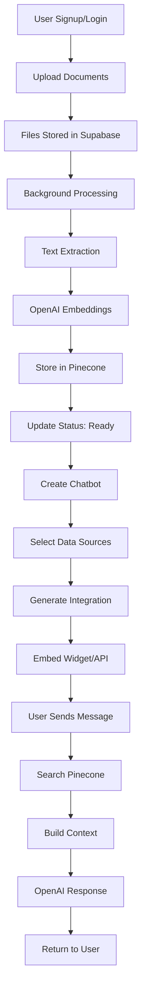

# 🏗️ AI Chatbot Platform - Backend Flow & Architecture

## 📋 Overview

This document outlines the complete backend flow for the multi-tenant AI chatbot platform, focusing on the data pipeline from authentication to chat interaction.

## 🎯 Core Flow Summary

```
User Authentication → File Upload → Vector Processing → Chatbot Creation → Integration → Chat Interface
```

---

## 🔐 1. Authentication Flow

### Implementation: Supabase Client SDK + Server SDK

**Frontend (Client SDK):**
- User signup/login via Supabase Auth
- Session management in browser
- Automatic token refresh

**Backend (Server SDK):**
- API routes use service role key
- User verification and data access control
- Multi-tenant data isolation

### Flow Diagram:
```
┌─────────────┐    ┌──────────────┐    ┌─────────────────┐
│   Browser   │───▶│ Supabase Auth│───▶│ Next.js API     │
│  (Client)   │    │  (Client SDK) │    │ (Server SDK)    │
└─────────────┘    └──────────────┘    └─────────────────┘
       │                    │                     │
       ▼                    ▼                     ▼
┌─────────────┐    ┌──────────────┐    ┌─────────────────┐
│ JWT Token   │    │ User Session │    │ Protected Routes│
│ Management  │    │ Persistence  │    │ + Data Access   │
└─────────────┘    └──────────────┘    └─────────────────┘
```

---

## 📁 2. File Upload & Processing Flow

### Current Implementation Analysis:
- ✅ Frontend upload UI exists (`EnhancedUploadZone`)
- ✅ File type detection implemented
- ✅ File status tracking (`processing`, `ready`, `error`)
- ❌ **Missing:** Backend API integration
- ❌ **Missing:** Supabase Storage integration
- ❌ **Missing:** Vector embedding pipeline

### Required Backend Implementation:

#### Step 1: File Upload API Route
```typescript
// /api/upload/route.ts
POST /api/upload
- Validates user authentication
- Uploads file to Supabase Storage
- Creates DataSource record in Supabase DB
- Triggers vector processing pipeline
```

#### Step 2: Vector Processing Pipeline
```typescript
// /api/process-file/route.ts
POST /api/process-file
- Extracts text from uploaded file (PDF, CSV, etc.)
- Chunks text into appropriate segments
- Generates embeddings using OpenAI API
- Stores vectors in Pinecone with metadata
- Updates DataSource status to "ready"
```

### Detailed Flow:

```
┌─────────────┐    ┌─────────────┐    ┌─────────────────┐
│   Frontend  │───▶│ /api/upload │───▶│ Supabase Storage│
│ File Upload │    │   (POST)    │    │   (File Blob)   │
└─────────────┘    └─────────────┘    └─────────────────┘
                           │
                           ▼
                  ┌─────────────────┐
                  │ Supabase DB     │
                  │ DataSource Table│
                  │ Status: processing
                  └─────────────────┘
                           │
                           ▼
                  ┌─────────────────┐    ┌─────────────┐
                  │ /api/process-file│───▶│ OpenAI API  │
                  │ Background Job  │    │ Embeddings  │
                  └─────────────────┘    └─────────────┘
                           │                     │
                           ▼                     ▼
                  ┌─────────────────┐    ┌─────────────┐
                  │ Pinecone Vector │    │ Text Chunks │
                  │ Database        │    │ + Vectors   │
                  └─────────────────┘    └─────────────┘
                           │
                           ▼
                  ┌─────────────────┐
                  │ Update Status   │
                  │ Status: ready   │
                  └─────────────────┘
```

---

## 🗄️ 3. Database Schema Design

### Supabase Tables:

#### `users` (Handled by Supabase Auth)
```sql
users (
  id: uuid PRIMARY KEY,
  email: text UNIQUE,
  name: text,
  company_id: uuid REFERENCES companies(id),
  created_at: timestamp
)
```

#### `companies`
```sql
companies (
  id: uuid PRIMARY KEY,
  name: text NOT NULL,
  logo: text,
  plan: text DEFAULT 'free',
  created_at: timestamp DEFAULT now()
)
```

#### `data_sources`
```sql
data_sources (
  id: uuid PRIMARY KEY,
  name: text NOT NULL,
  type: text NOT NULL, -- pdf, csv, xlsx, etc.
  size: bigint,
  status: text DEFAULT 'processing',
  storage_path: text, -- Supabase Storage path
  pinecone_namespace: text, -- Pinecone namespace/id
  company_id: uuid REFERENCES companies(id),
  created_at: timestamp DEFAULT now()
)
```

#### `chatbots`
```sql
chatbots (
  id: uuid PRIMARY KEY,
  name: text NOT NULL,
  description: text,
  welcome_message: text,
  personality: text DEFAULT 'professional',
  theme: jsonb, -- Colors and styling
  is_active: boolean DEFAULT true,
  company_id: uuid REFERENCES companies(id),
  created_at: timestamp DEFAULT now()
)
```

#### `chatbot_data_sources`
```sql
chatbot_data_sources (
  id: uuid PRIMARY KEY,
  chatbot_id: uuid REFERENCES chatbots(id) ON DELETE CASCADE,
  data_source_id: uuid REFERENCES data_sources(id) ON DELETE CASCADE,
  created_at: timestamp DEFAULT now()
)
```

#### `integrations`
```sql
integrations (
  id: uuid PRIMARY KEY,
  chatbot_id: uuid REFERENCES chatbots(id) ON DELETE CASCADE,
  type: text NOT NULL, -- widget, iframe, api
  api_key: text UNIQUE,
  settings: jsonb,
  company_id: uuid REFERENCES companies(id),
  created_at: timestamp DEFAULT now()
)
```

### Pinecone Structure:

```json
{
  "vectors": [
    {
      "id": "datasource_123_chunk_1",
      "values": [0.1, 0.2, ...], // OpenAI embedding
      "metadata": {
        "company_id": "company_uuid",
        "data_source_id": "datasource_uuid",
        "chunk_text": "Original text content...",
        "file_name": "document.pdf",
        "page_number": 1
      }
    }
  ]
}
```

---

## 🤖 4. Chatbot Creation & Management

### Current Status:
- ✅ Frontend chatbot creation UI exists
- ✅ Data source selection implemented
- ❌ **Missing:** Backend API for chatbot CRUD operations

### Required Implementation:

```typescript
// /api/chatbots/route.ts
GET /api/chatbots - List user's chatbots
POST /api/chatbots - Create new chatbot

// /api/chatbots/[id]/route.ts
GET /api/chatbots/[id] - Get chatbot details
PUT /api/chatbots/[id] - Update chatbot
DELETE /api/chatbots/[id] - Delete chatbot
```

### Flow Diagram:

```
┌─────────────────┐    ┌─────────────────┐    ┌─────────────────┐
│ Frontend Form   │───▶│ /api/chatbots   │───▶│ Supabase DB     │
│ - Name          │    │ (POST)          │    │ - chatbots      │
│ - Description   │    │ - Validation    │    │ - relations     │
│ - Data Sources  │    │ - Auth Check    │    │                 │
└─────────────────┘    └─────────────────┘    └─────────────────┘
                                │
                                ▼
                       ┌─────────────────┐
                       │ Generate        │
                       │ - API Key       │
                       │ - Integration   │
                       │ - Widget Code   │
                       └─────────────────┘
```

---

## 🔗 5. Integration & Embedding

### Current Status:
- ✅ Frontend integration UI exists
- ✅ Code generation for Widget/iFrame/API
- ❌ **Missing:** Backend endpoints for integrations

### Required Implementation:

```typescript
// /api/integrations/route.ts
GET /api/integrations/[chatbot_id] - Get integration details
POST /api/integrations - Create/update integration

// /api/widget/[chatbot_id]/route.ts
GET /api/widget/[chatbot_id] - Serve widget JavaScript

// /api/embed/[chatbot_id]/route.ts
GET /api/embed/[chatbot_id] - Serve iframe HTML
```

---

## 💬 6. Chat Interface & AI Response

### Implementation Flow:

```
┌─────────────┐    ┌─────────────────┐    ┌─────────────────┐
│ User Message│───▶│ /api/chat       │───▶│ Pinecone Search │
│ (Widget/Web)│    │ (POST)          │    │ - Query vectors │
│             │    │ - Auth check    │    │ - Find relevant │
└─────────────┘    │ - Rate limiting │    │   content       │
                   └─────────────────┘    └─────────────────┘
                            │                       │
                            ▼                       ▼
                   ┌─────────────────┐    ┌─────────────────┐
                   │ OpenAI API      │◀───│ Context Builder │
                   │ - GPT Response  │    │ - Relevant docs │
                   │ - System prompt │    │ - Chat history  │
                   └─────────────────┘    └─────────────────┘
                            │
                            ▼
                   ┌─────────────────┐
                   │ Response to User│
                   │ - Formatted     │
                   │ - Streamed      │
                   └─────────────────┘
```

### Required API Route:

```typescript
// /api/chat/route.ts
POST /api/chat
{
  "chatbot_id": "uuid",
  "message": "User question",
  "session_id": "session_uuid", // For conversation context
  "context": "additional_context" // Optional
}

Response:
{
  "response": "AI generated answer",
  "sources": ["doc1.pdf page 2", "doc2.csv row 15"],
  "session_id": "session_uuid"
}
```

---

## 📊 7. Complete API Structure

### Required API Routes:

```
🔐 Authentication
└── Handled by Supabase Auth (Client SDK)

📁 File Management
├── POST /api/upload - Upload files to storage
├── POST /api/process-file - Process & vectorize files
└── GET /api/files/[id] - Get file details

🤖 Chatbot Management
├── GET /api/chatbots - List chatbots
├── POST /api/chatbots - Create chatbot
├── GET /api/chatbots/[id] - Get chatbot
├── PUT /api/chatbots/[id] - Update chatbot
└── DELETE /api/chatbots/[id] - Delete chatbot

🔗 Integrations
├── GET /api/integrations/[chatbot_id] - Get integration
├── POST /api/integrations - Create integration
├── GET /api/widget/[chatbot_id] - Widget JS
└── GET /api/embed/[chatbot_id] - Embed HTML

💬 Chat Interface
├── POST /api/chat - Process chat messages
├── GET /api/conversations/[session_id] - Get chat history
└── POST /api/chat/stream - Streaming responses

📈 Analytics
├── GET /api/analytics/dashboard - Dashboard stats
└── GET /api/analytics/chatbot/[id] - Chatbot metrics
```

---

## 🔄 8. Data Flow Summary

### Complete User Journey:



---

## ✅ Implementation Priority

### Phase 1: Core Backend (Immediate)
1. **File Upload API** - `/api/upload`
2. **Vector Processing** - `/api/process-file`
3. **Chatbot CRUD** - `/api/chatbots/*`
4. **Basic Chat API** - `/api/chat`

### Phase 2: Integrations
1. **Widget/Embed APIs** - `/api/widget/*`, `/api/embed/*`
2. **Integration Management** - `/api/integrations/*`
3. **Authentication Middleware**

### Phase 3: Advanced Features
1. **Streaming Responses** - `/api/chat/stream`
2. **Analytics APIs** - `/api/analytics/*`
3. **Rate Limiting & Monitoring**

---

## 🛡️ Security Considerations

### Data Isolation
- All queries filtered by `company_id`
- Row Level Security (RLS) in Supabase
- Pinecone namespacing by company

### API Security
- Supabase JWT validation
- Rate limiting per company
- API key rotation for integrations
- Input validation & sanitization

### File Security
- Virus scanning before processing
- File type validation
- Size limits enforcement
- Secure storage paths

---

## 📈 Scalability Considerations

### Database
- Proper indexing on `company_id`, `created_at`
- Connection pooling
- Read replicas for analytics

### Vector Database
- Pinecone namespacing for isolation
- Batch processing for embeddings
- Caching for frequent queries

### Processing
- Background job queues for file processing
- Webhooks for status updates
- Horizontal scaling with serverless functions

---

## 🎯 Conclusion

This flow provides a robust, scalable foundation for the AI chatbot platform. The architecture ensures:

- **Multi-tenancy** through proper data isolation
- **Security** with Supabase Auth + API keys
- **Performance** with vector search + caching
- **Scalability** with serverless architecture
- **Maintainability** with clear API structure

The current frontend implementation aligns perfectly with this backend architecture, requiring only the API routes to be implemented to complete the full stack application.