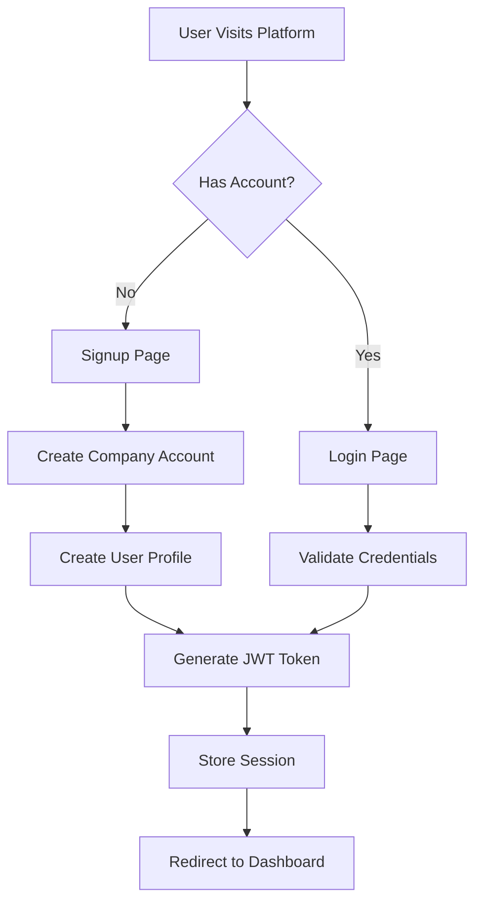
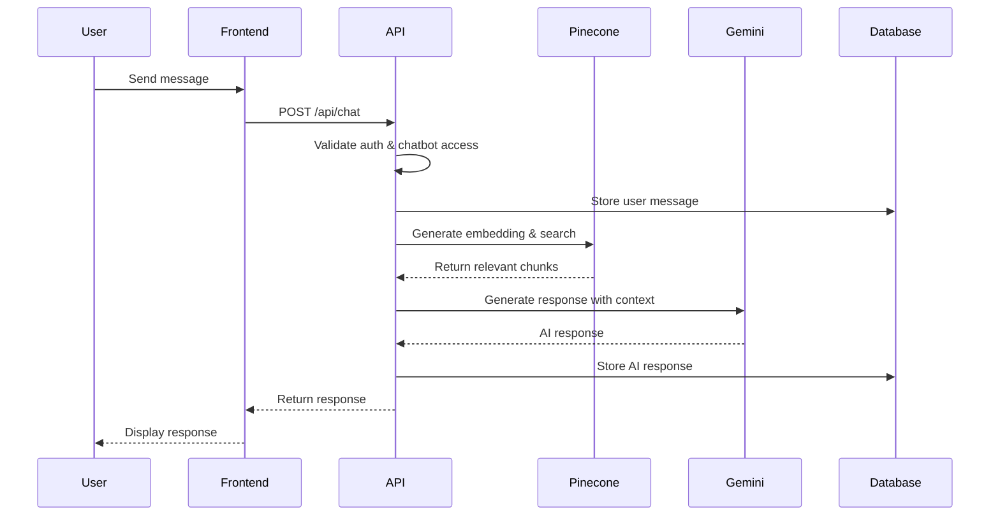

# Detailed Process Flow & Algorithms

## Table of Contents
- [Overview](#overview)
- [1. User Registration & Authentication Flow](#1-user-registration--authentication-flow)
- [2. Document Processing Pipeline](#2-document-processing-pipeline)
- [3. Chatbot Interaction Flow](#3-chatbot-interaction-flow)
- [4. RAG (Retrieval Augmented Generation) Algorithm](#4-rag-retrieval-augmented-generation-algorithm)
- [5. Data Security & Isolation](#5-data-security--isolation)
- [6. Integration Workflows](#6-integration-workflows)

## Overview

This document provides an in-depth explanation of how the AI Chatbot Platform processes data, handles user interactions, and generates intelligent responses using state-of-the-art algorithms.

## 1. User Registration & Authentication Flow

### Process Steps



### Algorithm Details

1. **Password Hashing**: Uses bcrypt with salt rounds for secure password storage
2. **JWT Generation**: Creates tokens with user_id, company_id, role, and expiration
3. **Session Management**: Stores refresh tokens in HttpOnly cookies
4. **Role Assignment**: Automatic "owner" role for company creators

### Implementation Code Flow

```typescript
// Authentication Process
1. User submits credentials
2. Supabase Auth validates
3. Create/Update user profile with company association
4. Generate session with appropriate permissions
5. Redirect based on user role
```

## 2. Document Processing Pipeline

### Detailed Pipeline

```
┌─────────────────┐     ┌──────────────┐     ┌─────────────────┐
│  File Upload    │ --> │ Text Extract │ --> │   Chunking      │
│  (Via UI)       │     │  (Type-based)│     │  (Smart Split)  │
└─────────────────┘     └──────────────┘     └─────────────────┘
                                                      |
                                                      v
┌─────────────────┐     ┌──────────────┐     ┌─────────────────┐
│  Store Vectors  │ <-- │  Generate    │ <-- │   Clean Text    │
│  (Pinecone)     │     │  Embeddings  │     │  (Normalize)    │
└─────────────────┘     └──────────────┘     └─────────────────┘
```

### Text Extraction Algorithms

#### PDF Processing
```typescript
1. Load PDF buffer using pdf2json
2. Parse pages sequentially
3. Extract text maintaining structure
4. Handle encoding issues
5. Merge text blocks intelligently
```

#### DOCX Processing
```typescript
1. Use mammoth.js for extraction
2. Preserve paragraph structure
3. Extract tables as formatted text
4. Handle embedded images (skip or OCR)
```

#### Chunking Algorithm
```typescript
function smartChunk(text: string, maxChunkSize: number = 1000) {
  // 1. Split by paragraphs first
  // 2. If paragraph > maxChunkSize, split by sentences
  // 3. If sentence > maxChunkSize, split by words
  // 4. Maintain context overlap (10% of chunk size)
  // 5. Preserve semantic boundaries
}
```

### Embedding Generation Process

1. **Text Preprocessing**
   - Remove excessive whitespace
   - Normalize unicode characters
   - Handle special characters
   - Truncate to model limits (512 tokens)

2. **API Call to Hugging Face**
   ```typescript
   POST https://api-inference.huggingface.co/models/sentence-transformers/all-MiniLM-L6-v2
   {
     "inputs": "preprocessed text chunk"
   }
   // Returns: 384-dimensional vector
   ```

3. **Vector Storage**
   - Generate unique ID: `{documentId}_{chunkIndex}`
   - Store with metadata (text, position, document info)
   - Use company-specific namespace

## 3. Chatbot Interaction Flow

### Complete Chat Process



### Response Generation Algorithm

```typescript
async function generateResponse(userMessage: string, context: string[]) {
  // 1. Build prompt with system instructions
  const systemPrompt = buildSystemPrompt(chatbot.personality);
  
  // 2. Combine context chunks
  const contextText = context.join('\n\n');
  
  // 3. Create full prompt
  const prompt = `
    ${systemPrompt}
    
    Context:
    ${contextText}
    
    User Question: ${userMessage}
    
    Instructions:
    - Answer based on the provided context
    - If information is not in context, say so politely
    - Maintain the specified personality tone
  `;
  
  // 4. Call Gemini API
  const response = await gemini.generateContent(prompt);
  
  // 5. Post-process response
  return cleanAndFormatResponse(response);
}
```

## 4. RAG (Retrieval Augmented Generation) Algorithm

### Overview
RAG combines the power of retrieval systems with generative AI to provide accurate, context-aware responses.

### Detailed Steps

1. **Query Embedding**
   ```typescript
   const queryVector = await generateEmbedding(userMessage);
   ```

2. **Similarity Search**
   ```typescript
   const searchParams = {
     vector: queryVector,
     topK: 40,  // Retrieve top 40 chunks
     includeMetadata: true,
     namespace: chatbot.pinecone_namespace,
     filter: {
       company_id: { $eq: companyId }
     }
   };
   ```

3. **Relevance Scoring**
   - Cosine similarity threshold: 0.7
   - Re-rank by recency if scores are close
   - Deduplicate overlapping chunks

4. **Context Window Management**
   ```typescript
   const MAX_CONTEXT_LENGTH = 8000; // tokens
   let contextChunks = [];
   let currentLength = 0;
   
   for (const chunk of rankedChunks) {
     const chunkLength = estimateTokens(chunk.text);
     if (currentLength + chunkLength <= MAX_CONTEXT_LENGTH) {
       contextChunks.push(chunk);
       currentLength += chunkLength;
     }
   }
   ```

5. **Prompt Engineering**
   - Dynamic prompt based on chatbot personality
   - Context injection with clear boundaries
   - Few-shot examples for consistency

## 5. Data Security & Isolation

### Multi-tenant Isolation Strategy

1. **Database Level**
   - Row-level security policies
   - Company_id filtering on all queries
   - Separate storage buckets per company

2. **Vector Database Level**
   ```typescript
   // Namespace pattern: {companyId}_{chatbotId}
   const namespace = `${company.id}_${chatbot.id}`;
   ```

3. **API Level**
   - JWT validation on every request
   - Company ownership verification
   - Role-based access control

### Security Algorithms

```typescript
// API Key Generation
function generateApiKey(): string {
  const prefix = 'ck_'; // chatbot key
  const randomBytes = crypto.randomBytes(32);
  const hash = crypto.createHash('sha256')
    .update(randomBytes)
    .digest('hex');
  return `${prefix}${hash}`;
}

// Key Validation
async function validateApiKey(key: string, chatbotId: string) {
  const hashedKey = await bcrypt.hash(key, 10);
  const storedKey = await getStoredKey(chatbotId);
  return bcrypt.compare(key, storedKey.hash);
}
```

## 6. Integration Workflows

### Widget Integration Flow

1. **Initialization**
   ```javascript
   // Widget loads and validates configuration
   const config = {
     chatbotId: 'uuid',
     apiKey: 'ck_...',
     theme: { ... }
   };
   ```

2. **Session Management**
   - Generate unique session ID
   - Store in localStorage
   - Maintain conversation context

3. **Message Queue**
   ```typescript
   class MessageQueue {
     private queue: Message[] = [];
     private processing = false;
     
     async process() {
       if (this.processing) return;
       this.processing = true;
       
       while (this.queue.length > 0) {
         const message = this.queue.shift();
         await this.sendMessage(message);
       }
       
       this.processing = false;
     }
   }
   ```

### API Integration Pattern

```typescript
// REST API Usage
const response = await fetch('https://platform.com/api/chat', {
  method: 'POST',
  headers: {
    'Authorization': `Bearer ${apiKey}`,
    'Content-Type': 'application/json'
  },
  body: JSON.stringify({
    chatbotId,
    message: userMessage,
    sessionId
  })
});

// Response handling with retry logic
async function sendWithRetry(message: string, maxRetries = 3) {
  for (let i = 0; i < maxRetries; i++) {
    try {
      return await sendMessage(message);
    } catch (error) {
      if (i === maxRetries - 1) throw error;
      await sleep(Math.pow(2, i) * 1000); // Exponential backoff
    }
  }
}
```

## Performance Optimizations

### Caching Strategy
1. **Embedding Cache**: Store frequently used embeddings
2. **Response Cache**: Cache common Q&A pairs
3. **Context Cache**: Reuse retrieved contexts for similar queries

### Batch Processing
```typescript
// Process multiple chunks in parallel
const embeddings = await Promise.all(
  chunks.map(chunk => generateEmbedding(chunk))
);
```

### Stream Processing
```typescript
// Stream responses for better UX
async function* streamResponse(prompt: string) {
  const stream = await gemini.generateContentStream(prompt);
  for await (const chunk of stream) {
    yield chunk.text();
  }
}
```

## Monitoring & Analytics

### Metrics Collection
1. **Response Time**: Track embedding + search + generation time
2. **Relevance Score**: Monitor average similarity scores
3. **User Satisfaction**: Track feedback and conversation completion
4. **Resource Usage**: Monitor API calls and storage consumption

### Analytics Algorithms
```typescript
// Calculate moving average response time
function calculateMovingAverage(times: number[], window: number) {
  const recent = times.slice(-window);
  return recent.reduce((a, b) => a + b, 0) / recent.length;
}

// Identify trending topics
function findTrendingTopics(messages: Message[]) {
  const topics = extractTopics(messages);
  return topics.sort((a, b) => b.frequency - a.frequency).slice(0, 10);
}
```
